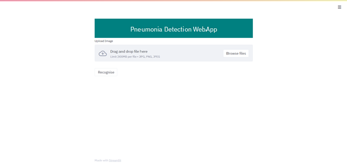
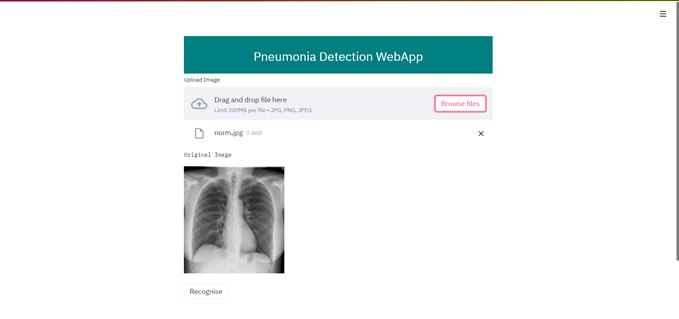
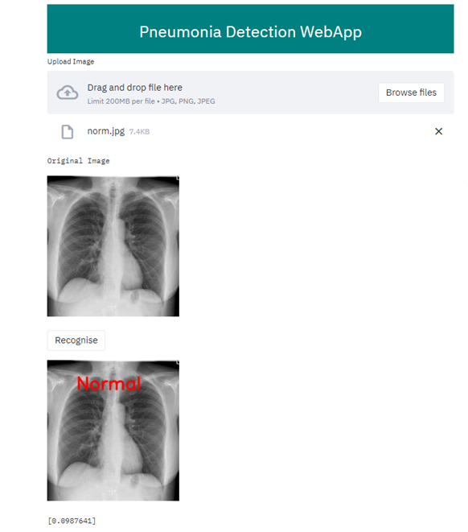

# Pneumomia Detection
Pneumonia is the leading cause of death for children under 5 — more than 800,000 children died due to pneumonia in 2017. On average, It causes the death of around 700,000 children every year and affects 7% of the global population. Chest X-rays are primarily used for the diagnosis of this disease. However, even for a trained radiologist, it is a challenging task to examine chest X-rays. The cost of getting the X-rays checked by a trained doctor can also be high and especially in a country like India where doctors per million are very less, not accessible to everyone. Hence to make basic testing available for all this detection program was developed by us. In this, we aimed to make a highly accurate system to detect Pneumonia by looking at the patient's X-rays. This can help the doctors at eliminating cases where Pneumonia is not present and focus on the actual cases. 
We have used transfer learning and Image processing to train our program to detect Pneumonia cases. With a data set of nearly 7000 pictures, the training has a wide variety of cases. This approach is a supervised learning approach in which the network learns by using labelled data and then predicts the unlabeled data. Data augmentation techniques are employed to generate a variety of images to increase the size of an already huge training set.
The final proposed weighted classifier model can achieve a test accuracy of 96.20% and a recall score of 97.44% on the unseen data from the Guangzhou Women and Children’s Medical Center pneumonia dataset. Hence, the proposed model can be used for a quick diagnosis of pneumonia and can aid the radiologists in the diagnosis process.

This project aims to detect Pneumonia from X-rays images using the convolutional neural networks.
However, this is not meant to be a substitute for a professional human doctor, it is only meant to aid them in making decisions on the diagnosis of the disease. 
The use-case of this project is also for individuals to get an idea if he/she has the disease after they have gotten the X-ray done and a doctor is not available/ appointment is scheduled for a few days later

**Detailed explanation of Algorithm steps involved for every block**

**Image Preprocessing -** 

This is the first step in the proposed solution. After testing many Image Processing techniques we narrowed down to 2 IP techniques - Histogram Equalization followed by “Closing and Then Opening” Concept of Morphological Operations.
Ex:

**Image Augmentation -**

It is the second stage where we generate a few more augmented images for the sole purpose of training. Although we already had 6500+ training images, few more would only help. We used two techniques - zooming and horizontal flipping for generating a few more images for training.
We also resized all the images (both training and testing) to 300x300 in this stage.

**Training -**  

We have used a Convolutional Neural Network to train the model. We used the concept of Transfer Learning, in which we use a model trained on millions of images and whose classification accuracy was found to be very high for a large number of objects.

In our case, the top layer of the model is the Resnet50v2 model followed by groups of dense and dropout layers to modify the output according to our requirement.
We have used ‘Adam’ as the optimizer and ‘binary cross-entropy’ as the loss function. 
We have used the concept of ReduceLROnPlateau which reduces the learning rate (which was initialized as 0.0001) if the validation loss doesn’t go down for a given number of epochs.
We have also used the concept of early stopping to avoid the model to overfit by stopping the training after it reaches 97.5% training accuracy hence it learns the features from the images instead of just mugging up the images.
We used the test set as our validation set while training and adjusted the learning rate according to the validation loss. 

**Testing -**
 
We tested our model against 624 test images and achieved an accuracy of 96% and a recall of 97.4%. We processed all the images as per our preprocessing pipeline and then evaluated our model against these images.

**Deployment -** 

We have used the ‘Streamlit’ framework for deploying our app on the web. It is a python based framework built for deploying Machine Learning projects on the web.

**Homepage -**

**Choose the file -**

**Get the prediction with confidence percentage -**

